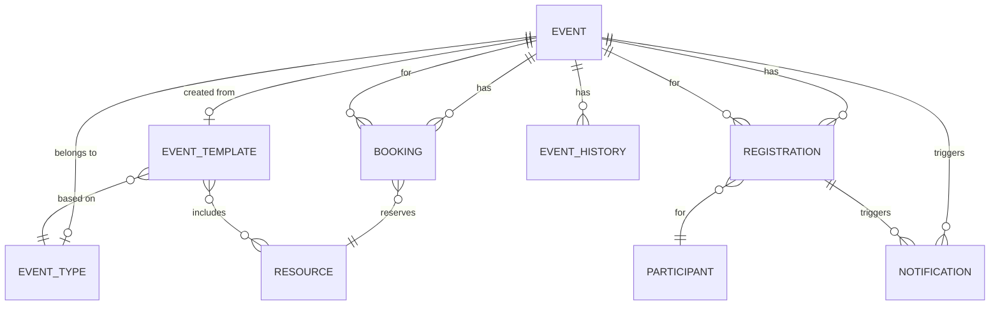

# Технічний дизайн: Система управління івентами

## Overview

Система управління івентами для розважального центру "Жирафик" - це комплексне рішення для автоматизації повного циклу організації заходів: від планування та бронювання ресурсів до реєстрації учасників та фінансової звітності. Система інтегрується з існуючими модулями персоналу та бухгалтерії через RESTful API.

### Ключові можливості

- Створення та управління заходами з підтримкою шаблонів
- Інтелектуальне бронювання ресурсів з виявленням конфліктів
- Візуальний календар з різними режимами перегляду
- Реєстрація учасників з автоматичним управлінням списками очікування
- Інтеграція з модулями персоналу та бухгалтерії
- Автоматичні нотифікації через email та SMS
- Комплексна звітність з аналітикою

### Технологічний стек

- **Frontend**: Next.js 16.1.1, React, TypeScript
- **Backend**: Next.js API Routes (App Router)
- **Database**: MongoDB 
- **Authentication**: JWT (jose/jsonwebtoken)
- **Validation**: Zod або custom validators
- **Notifications**: Email (nodemailer), SMS (Twilio або аналог)

## Architecture

### Загальна архітектура

Система побудована на основі монолітної архітектури з модульною структурою, що відповідає існуючим патернам проекту. Використовується серверний рендеринг Next.js з API routes для backend логіки.

```
┌─────────────────────────────────────────────────────────────┐
│                     Client Layer (Browser)                   │
│  ┌──────────────┐  ┌──────────────┐  ┌──────────────┐      │
│  │   Calendar   │  │  Event Form  │  │  Reports     │      │
│  │   Component  │  │  Component   │  │  Dashboard   │      │
│  └──────────────┘  └──────────────┘  └──────────────┘      │
└─────────────────────────────────────────────────────────────┘
                            │
                            ▼
┌─────────────────────────────────────────────────────────────┐
│                  Next.js API Routes Layer                    │
│  ┌──────────────┐  ┌──────────────┐  ┌──────────────┐      │
│  │   /events    │  │  /bookings   │  │ /registrations│     │
│  │   /templates │  │  /resources  │  │ /notifications│     │
│  └──────────────┘  └──────────────┘  └──────────────┘      │
└─────────────────────────────────────────────────────────────┘
                            │
                            ▼
┌─────────────────────────────────────────────────────────────┐
│                    Service Layer                             │
│  ┌──────────────┐  ┌──────────────┐  ┌──────────────┐      │
│  │EventService  │  │BookingService│  │NotificationSvc│     │
│  │TemplateService│ │ResourceService│ │ReportService │     │
│  └──────────────┘  └──────────────┘  └──────────────┘      │
└─────────────────────────────────────────────────────────────┘
                            │
        ┌───────────────────┼───────────────────┐
        ▼                   ▼                   ▼
┌──────────────┐  ┌──────────────┐  ┌──────────────┐
│   MongoDB    │  │  Staff API   │  │Accounting API│
│   Database   │  │  (External)  │  │  (External)  │
└──────────────┘  └──────────────┘  └──────────────┘
```

### Структура API endpoints

```
/api/events/
  ├── events/
  │   ├── route.ts              (GET, POST)
  │   ├── [id]/
  │   │   ├── route.ts          (GET, PUT, DELETE)
  │   │   └── history/route.ts  (GET)
  │   └── search/route.ts       (GET)
  │
  ├── event-types/
  │   ├── route.ts              (GET, POST)
  │   └── [id]/route.ts         (GET, PUT, DELETE)
  │
  ├── templates/
  │   ├── route.ts              (GET, POST)
  │   └── [id]/route.ts         (GET, PUT, DELETE)
  │
  ├── resources/
  │   ├── route.ts              (GET, POST)
  │   ├── [id]/route.ts         (GET, PUT, DELETE)
  │   └── availability/route.ts (GET)
  │
  ├── bookings/
  │   ├── route.ts              (GET, POST)
  │   ├── [id]/route.ts         (GET, PUT, DELETE)
  │   └── conflicts/route.ts    (GET)
  │
  ├── registrations/
  │   ├── route.ts              (GET, POST)
  │   ├── [id]/route.ts         (GET, PUT, DELETE)
  │   └── export/route.ts       (GET)
  │
  ├── participants/
  │   ├── route.ts              (GET, POST)
  │   ├── [id]/route.ts         (GET, PUT, DELETE)
  │   └── search/route.ts       (GET)
  │
  ├── calendar/
  │   └── route.ts              (GET)
  │
  ├── notifications/
  │   ├── route.ts              (GET, POST)
  │   └── history/route.ts      (GET)
  │
  └── reports/
      ├── route.ts              (GET)
      └── export/route.ts       (GET)
```

### Патерни проектування

1. **Repository Pattern**: Абстракція доступу до даних через service layer
2. **Factory Pattern**: Створення івентів з шаблонів
3. **Observer Pattern**: Система нотифікацій при зміні статусів
4. **Strategy Pattern**: Різні стратегії ціноутворення
5. **Chain of Responsibility**: Валідація даних на різних рівнях

## Components and Interfaces

### Core Services

#### EventService

Відповідає за управління життєвим циклом заходів.

```typescript
interface EventService {
  createEvent(data: CreateEventDTO): Promise<Event>;
  updateEvent(id: string, data: UpdateEventDTO): Promise<Event>;
  deleteEvent(id: string): Promise<void>;
  getEvent(id: string): Promise<Event | null>;
  listEvents(filters: EventFilters): Promise<PaginatedResult<Event>>;
  changeStatus(id: string, status: EventStatus): Promise<Event>;
  getEventHistory(id: string): Promise<EventHistory[]>;
}
```

#### BookingService

Управляє бронюванням ресурсів з перевіркою конфліктів.

```typescript
interface BookingService {
  createBooking(data: CreateBookingDTO): Promise<Booking>;
  checkAvailability(resourceId: string, timeRange: TimeRange): Promise<boolean>;
  findConflicts(resourceId: string, timeRange: TimeRange): Promise<Booking[]>;
  cancelBooking(id: string): Promise<void>;
  getResourceBookings(resourceId: string, dateRange: DateRange): Promise<Booking[]>;
}
```

#### RegistrationService

Керує реєстрацією учасників та списками очікування.

```typescript
interface RegistrationService {
  registerParticipant(data: CreateRegistrationDTO): Promise<Registration>;
  cancelRegistration(id: string): Promise<void>;
  confirmRegistration(id: string): Promise<Registration>;
  moveFromWaitlist(): Promise<void>;
  getEventRegistrations(eventId: string): Promise<Registration[]>;
  exportRegistrations(eventId: string, format: 'csv' | 'excel'): Promise<Buffer>;
}
```

#### NotificationService

Відправляє нотифікації через різні канали.

```typescript
interface NotificationService {
  sendNotification(data: NotificationDTO): Promise<NotificationResult>;
  scheduleNotification(data: ScheduledNotificationDTO): Promise<void>;
  getNotificationHistory(filters: NotificationFilters): Promise<Notification[]>;
  sendEventReminder(eventId: string, hoursBeforeEvent: number): Promise<void>;
}
```

#### IntegrationService

Забезпечує інтеграцію з зовнішніми модулями.

```typescript
interface IntegrationService {
  // Staff module integration
  getAvailableStaff(timeRange: TimeRange): Promise<StaffMember[]>;
  assignStaffToEvent(eventId: string, staffId: string, role: string): Promise<void>;
  reportWorkedHours(eventId: string): Promise<void>;
  
  // Accounting module integration
  createPaymentRecord(data: PaymentDTO): Promise<PaymentResult>;
  sendFinancialReport(eventId: string): Promise<void>;
}
```

### API Request/Response Types

#### Event DTOs

```typescript
interface CreateEventDTO {
  name: string;
  typeId?: string;
  templateId?: string;
  description: string;
  startDate: Date;
  endDate: Date;
  maxParticipants?: number;
  pricing?: PricingDTO;
  resources?: string[];
  staff?: StaffAssignmentDTO[];
}

interface UpdateEventDTO {
  name?: string;
  description?: string;
  startDate?: Date;
  endDate?: Date;
  maxParticipants?: number;
  pricing?: PricingDTO;
}

interface EventFilters {
  status?: EventStatus[];
  typeId?: string;
  startDate?: Date;
  endDate?: Date;
  search?: string;
  page?: number;
  limit?: number;
}
```

#### Booking DTOs

```typescript
interface CreateBookingDTO {
  resourceId: string;
  eventId: string;
  startTime: Date;
  endTime: Date;
  notes?: string;
}

interface TimeRange {
  start: Date;
  end: Date;
}
```

#### Registration DTOs

```typescript
interface CreateRegistrationDTO {
  eventId: string;
  participant: ParticipantDTO;
  additionalServices?: string[];
  notes?: string;
}

interface ParticipantDTO {
  firstName: string;
  lastName: string;
  age?: number;
  phone: string;
  email: string;
}
```

### Utility Functions

```typescript
// Валідація дат
function validateEventDates(startDate: Date, endDate: Date): ValidationResult;

// Перевірка конфліктів часу
function hasTimeConflict(range1: TimeRange, range2: TimeRange): boolean;

// Розрахунок вартості
function calculateEventCost(event: Event, registrations: Registration[]): number;

// Форматування для експорту
function formatForExport(data: any[], format: 'csv' | 'excel'): Buffer;
```

## Data Models

### MongoDB Collections

#### events

```typescript
interface Event {
  _id: ObjectId;
  name: string;
  typeId?: ObjectId;
  templateId?: ObjectId;
  description: string;
  startDate: Date;
  endDate: Date;
  status: 'draft' | 'scheduled' | 'in_progress' | 'completed' | 'cancelled';
  maxParticipants?: number;
  pricing?: {
    type: 'fixed' | 'per_participant' | 'package';
    basePrice: number;
    discounts?: Discount[];
    additionalServices?: AdditionalService[];
  };
  createdBy: string;
  createdAt: Date;
  updatedAt: Date;
}

interface Discount {
  reason: string;
  type: 'percentage' | 'fixed';
  value: number;
}

interface AdditionalService {
  name: string;
  price: number;
}
```

**Indexes:**
- `{ startDate: 1, endDate: 1 }` - для календаря та пошуку по датах
- `{ status: 1, startDate: 1 }` - для фільтрації по статусу
- `{ typeId: 1 }` - для фільтрації по типу
- `{ name: "text", description: "text" }` - для текстового пошуку

#### event_types

```typescript
interface EventType {
  _id: ObjectId;
  name: string;
  description: string;
  defaultDuration: number; // в хвилинах
  defaultMaxParticipants: number;
  createdAt: Date;
  updatedAt: Date;
}
```

#### event_templates

```typescript
interface EventTemplate {
  _id: ObjectId;
  name: string;
  typeId: ObjectId;
  description: string;
  duration: number;
  maxParticipants: number;
  defaultResources: ObjectId[];
  defaultStaff: {
    role: string;
    count: number;
  }[];
  pricing: {
    type: 'fixed' | 'per_participant' | 'package';
    basePrice: number;
    additionalServices?: AdditionalService[];
  };
  createdAt: Date;
  updatedAt: Date;
}
```

#### resources

```typescript
interface Resource {
  _id: ObjectId;
  name: string;
  type: 'room' | 'staff' | 'equipment';
  description?: string;
  capacity?: number; // для залів
  status: 'available' | 'maintenance' | 'unavailable';
  createdAt: Date;
  updatedAt: Date;
}
```

**Indexes:**
- `{ type: 1, status: 1 }` - для фільтрації доступних ресурсів

#### bookings

```typescript
interface Booking {
  _id: ObjectId;
  resourceId: ObjectId;
  eventId: ObjectId;
  startTime: Date;
  endTime: Date;
  status: 'reserved' | 'confirmed' | 'cancelled';
  notes?: string;
  createdAt: Date;
  updatedAt: Date;
}
```

**Indexes:**
- `{ resourceId: 1, startTime: 1, endTime: 1 }` - для перевірки конфліктів
- `{ eventId: 1 }` - для отримання всіх бронювань події
- `{ startTime: 1, endTime: 1 }` - для календаря

#### participants

```typescript
interface Participant {
  _id: ObjectId;
  firstName: string;
  lastName: string;
  age?: number;
  phone: string;
  email: string;
  createdAt: Date;
  updatedAt: Date;
}
```

**Indexes:**
- `{ email: 1 }` - унікальний індекс
- `{ phone: 1 }` - для пошуку
- `{ firstName: "text", lastName: "text" }` - для текстового пошуку

#### registrations

```typescript
interface Registration {
  _id: ObjectId;
  participantId: ObjectId;
  eventId: ObjectId;
  status: 'pending' | 'confirmed' | 'cancelled' | 'waitlist';
  additionalServices?: string[];
  totalCost?: number;
  paymentStatus?: 'pending' | 'paid' | 'refunded';
  notes?: string;
  registeredAt: Date;
  confirmedAt?: Date;
  cancelledAt?: Date;
  createdAt: Date;
  updatedAt: Date;
}
```

**Indexes:**
- `{ eventId: 1, status: 1 }` - для підрахунку реєстрацій
- `{ participantId: 1 }` - для історії учасника
- `{ registeredAt: 1 }` - для сортування списку очікування

#### event_history

```typescript
interface EventHistory {
  _id: ObjectId;
  eventId: ObjectId;
  action: string;
  changes: Record<string, any>;
  userId: string;
  timestamp: Date;
}
```

**Indexes:**
- `{ eventId: 1, timestamp: -1 }` - для отримання історії

#### notifications

```typescript
interface Notification {
  _id: ObjectId;
  type: 'email' | 'sms';
  recipient: string;
  subject?: string;
  message: string;
  relatedEntity: {
    type: 'event' | 'registration';
    id: ObjectId;
  };
  status: 'pending' | 'sent' | 'failed';
  sentAt?: Date;
  error?: string;
  createdAt: Date;
}
```

**Indexes:**
- `{ status: 1, createdAt: 1 }` - для обробки черги
- `{ relatedEntity.type: 1, relatedEntity.id: 1 }` - для історії

### Relationships




## Correctness Properties

*A property is a characteristic or behavior that should hold true across all valid executions of a system-essentially, a formal statement about what the system should do. Properties serve as the bridge between human-readable specifications and machine-verifiable correctness guarantees.*


### Property Reflection

After analyzing all acceptance criteria, I identified several areas of redundancy:

1. **Object Creation with Required Fields** (1.1, 2.1, 3.4, 5.1, 5.2, 7.1): These can be consolidated into a single property about required field validation across all entity types.

2. **MongoDB Persistence** (1.2, 2.5): Both test the same behavior - storing objects with unique IDs. Can be combined into one property.

3. **Status Value Validation** (1.7, 3.7, 5.5, 7.4, 10.5): All test that only valid enum values are accepted. Can be consolidated.

4. **Conflict Detection** (3.3, 6.4): Both test time-based conflict detection for resources and staff. Can be combined into one comprehensive property.

5. **Availability Checking** (3.2, 6.3): Both test availability checking before booking. Can be combined.

6. **Query by Date Range** (3.6, 4.1, 6.6): All test querying entities within a time period. Can be consolidated.

7. **Notification Scheduling** (8.2, 8.3, 8.4): All test scheduled notifications at different times. Can be combined into one property about notification scheduling.

8. **Export Functionality** (5.7, 9.6): Both test export to CSV/Excel. Can be combined.

9. **Filtering** (4.6, 9.5, 12.1, 12.2, 12.4): All test filtering functionality. Can be consolidated.

10. **API Integration** (6.1, 7.3, 7.6): All test external API calls. Can be combined.

11. **Validation** (11.2, 11.3, 11.7): All test field validation. Can be consolidated.

12. **Cost Calculation** (7.5, 9.2, 9.3): All test mathematical calculations. Can be kept separate as they test different formulas.

After reflection, I've reduced 84 testable criteria to approximately 40 unique properties that provide comprehensive coverage without redundancy.

### Correctness Properties

### Property 1: Required Field Validation

*For any* entity type (Event, EventType, Template, Resource, Booking, Registration, Participant, Pricing), creating an instance with missing required fields should be rejected with a validation error identifying the missing field.

**Validates: Requirements 1.1, 2.1, 3.4, 5.1, 5.2, 7.1, 11.1, 11.7**

### Property 2: MongoDB Persistence with Unique IDs

*For any* entity created in the system, saving it to MongoDB should assign a unique ObjectId, and retrieving it by that ID should return an equivalent object.

**Validates: Requirements 1.2, 2.5**

### Property 3: Event Date Validation

*For any* event, if the end date is before the start date, the system should reject the creation/update with a validation error.

**Validates: Requirements 1.3**

### Property 4: Event Update Time Restriction

*For any* event that has already started or is in the past, attempting to update its fields should be rejected with an appropriate error.

**Validates: Requirements 1.4**

### Property 5: Event History Audit Trail

*For any* event update operation, the system should create a history record containing the changes, timestamp, and user ID.

**Validates: Requirements 1.5**

### Property 6: Event Deletion with Registration Constraint

*For any* event with confirmed registrations, attempting to delete it should be rejected; events without confirmed registrations should be deletable.

**Validates: Requirements 1.6**

### Property 7: Valid Status Enumeration

*For any* entity with a status field (Event, Booking, Registration), only predefined valid status values should be accepted, and invalid values should be rejected.

**Validates: Requirements 1.7, 3.7, 5.5, 7.4, 10.5**

### Property 8: Template to Event Field Copying

*For any* event created from a template, all template fields (resources, staff, pricing, duration, max participants) should be copied to the new event.

**Validates: Requirements 2.3**

### Property 9: Template Independence

*For any* event created from a template, modifying the event's fields should not change the original template's fields.

**Validates: Requirements 2.4**

### Property 10: Resource Type Validation

*For any* resource, only the three valid types (room, staff, equipment) should be accepted, and invalid types should be rejected.

**Validates: Requirements 3.1**

### Property 11: Resource Availability Checking

*For any* resource and time range, the system should correctly determine if the resource is available (not booked) during that period.

**Validates: Requirements 3.2, 6.3**

### Property 12: Booking Conflict Detection

*For any* two bookings of the same resource with overlapping time ranges, the system should detect the conflict and reject the second booking with conflict information.

**Validates: Requirements 3.3, 6.4**

### Property 13: Event Cancellation Cascades to Bookings

*For any* event that is cancelled, all associated bookings should automatically be set to cancelled status.

**Validates: Requirements 3.5**

### Property 14: Query Entities by Date Range

*For any* date range query (events in calendar, resource bookings, staff assignments), the system should return all and only entities whose time range overlaps with the query range.

**Validates: Requirements 3.6, 4.1, 6.6**

### Property 15: Calendar Filtering

*For any* combination of filters (type, status, room), the calendar should return only events matching all specified criteria.

**Validates: Requirements 4.6, 9.5, 12.4**

### Property 16: Registration Capacity Enforcement

*For any* event with a maximum participant limit, the number of confirmed registrations should never exceed that limit.

**Validates: Requirements 5.3**

### Property 17: Waitlist Automatic Placement

*For any* event at maximum capacity, new registration attempts should automatically be placed in waitlist status rather than confirmed status.

**Validates: Requirements 5.4**

### Property 18: Waitlist Promotion on Cancellation

*For any* confirmed registration that is cancelled, if a waitlist exists, the first waitlist entry (by registration date) should be automatically promoted to confirmed status.

**Validates: Requirements 5.6**

### Property 19: Export Data Integrity

*For any* entity list exported to CSV or Excel format, parsing the exported file should yield data equivalent to the original list.

**Validates: Requirements 5.7, 9.6**

### Property 20: Staff Assignment Creates Booking

*For any* staff member assigned to an event, a booking record should be created with the staff member as the resource, including the specified role.

**Validates: Requirements 6.2, 6.5**

### Property 21: Staff Hours Reporting on Event Completion

*For any* event that transitions to completed status, the system should send worked hours data for all assigned staff to the staff module API.

**Validates: Requirements 6.7**

### Property 22: Confirmed Registration Creates Payment

*For any* registration that transitions to confirmed status, a payment record should be created.

**Validates: Requirements 7.2**

### Property 23: Payment Integration with Accounting

*For any* payment record created, the system should send payment information to the accounting module API.

**Validates: Requirements 7.3, 7.6**

### Property 24: Event Cost Calculation

*For any* event, the total cost should equal the sum of: (base price calculated according to pricing type) + (all additional services from all registrations) - (all discounts applied).

**Validates: Requirements 7.5**

### Property 25: Discount Requires Reason

*For any* discount applied to a registration, a non-empty reason field must be provided, otherwise the discount should be rejected.

**Validates: Requirements 7.7**

### Property 26: Registration Confirmation Triggers Notification

*For any* registration that transitions to confirmed status, a notification should be created and sent to the participant with event details.

**Validates: Requirements 8.1**

### Property 27: Scheduled Notification Creation

*For any* confirmed registration, the system should schedule notifications at 24 hours and 2 hours before the event start time.

**Validates: Requirements 8.2, 8.3, 8.4**

### Property 28: Event Cancellation Notifies All Parties

*For any* event that transitions to cancelled status, notifications should be sent to all participants with confirmed or waitlist registrations and all assigned staff members.

**Validates: Requirements 8.5**

### Property 29: Notification Channel Support

*For any* notification, the system should support both email and SMS delivery channels.

**Validates: Requirements 8.6**

### Property 30: Notification History Logging

*For any* notification sent, a record should be created in the notification history with recipient, message, status, and timestamp.

**Validates: Requirements 8.7**

### Property 31: Event Report Required Fields

*For any* event report generated, it should contain all required fields: event name, date, registered count, attended count, revenue, and expenses.

**Validates: Requirements 9.1**

### Property 32: Attendance Percentage Calculation

*For any* event report, the attendance percentage should equal (attended count / registered count) × 100, or 0 if registered count is 0.

**Validates: Requirements 9.2**

### Property 33: Profitability Calculation

*For any* event report, the profitability should equal revenue minus expenses.

**Validates: Requirements 9.3**

### Property 34: Aggregate Report Calculation

*For any* date range, the aggregate report should sum all individual event metrics (total registrations, total revenue, total expenses, average attendance) across all events in that range.

**Validates: Requirements 9.4**

### Property 35: JWT Authentication Required

*For any* API request to protected endpoints without a valid JWT token, the system should return HTTP 401 Unauthorized.

**Validates: Requirements 10.2, 10.3**

### Property 36: Role-Based Authorization

*For any* API operation, the system should verify the user's role has permission to perform that operation before executing it.

**Validates: Requirements 10.4**

### Property 37: API Request Logging

*For any* API request, the system should log the user ID, action, endpoint, and timestamp.

**Validates: Requirements 10.6**

### Property 38: Standardized Error Response Format

*For any* error response, the system should return a JSON object with a consistent structure containing an error code and descriptive message.

**Validates: Requirements 10.7**

### Property 39: Email and Phone Format Validation

*For any* participant, the email should match a valid email regex pattern and the phone should match a valid phone format, otherwise creation/update should be rejected.

**Validates: Requirements 11.2, 11.3**

### Property 40: Event Date Not in Past

*For any* new event being created, if the start date is in the past, the creation should be rejected with a validation error.

**Validates: Requirements 11.4**

### Property 41: Database Error Handling

*For any* operation that encounters a MongoDB connection error, the system should return HTTP 503 Service Unavailable.

**Validates: Requirements 11.5**

### Property 42: Internal Error Logging

*For any* internal server error, the system should log the error details (stack trace, context) and return HTTP 500 Internal Server Error to the client.

**Validates: Requirements 11.6**

### Property 43: Search with Partial Match

*For any* search query on text fields (event name, participant name), the system should return results that contain the search term as a substring, case-insensitively.

**Validates: Requirements 12.1, 12.2, 12.3**

### Property 44: Pagination Enforcement

*For any* search or list operation, results should be paginated with a maximum of 50 records per page.

**Validates: Requirements 12.5**

### Property 45: Result Sorting

*For any* search results, the system should support sorting by any specified field in ascending or descending order.

**Validates: Requirements 12.6**

